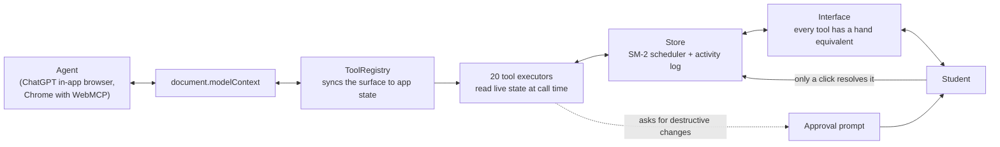

# Tandem

**A study board you and your agent share.**

Tandem is a spaced-repetition study app that publishes its own state as [WebMCP](https://github.com/webmachinelearning/webmcp) tools. An agent doesn't scrape the page or click through the interface. It reads the exact card you are looking at, drills the topics your grading history says you are weakest at, and pins explanations onto your cards that are still there next week.

Built for **The WebMCP Challenge** (OpenAI, September 2026).

[](https://github.com/gokdenis/tandem/actions/workflows/ci.yml)

## Why this is a WebMCP app and not a chatbot with a database

A chat assistant can already explain deadlock to you. What it cannot do is know that *you* have lapsed on the Coffman conditions five times, that the card is on your screen right now with the answer still hidden, and that the note it writes should live on that card forever.

Tandem exposes 20 tools across four groups:

| Group | Tools |
| --- | --- |
| **Read the student's state** | `list_decks` · `get_deck` · `search_cards` · `get_study_state` · `get_weak_topics` |
| **Change the material** | `create_deck` · `add_cards` · `update_card` · `annotate_card` · `delete_card` · `get_approval` · `set_exam_date` |
| **Drive the session** | `start_session` · `reveal_answer` · `grade_current_card` · `queue_cards` · `end_session` |
| **Point and plan** | `highlight` · `plan_revision` · `get_note_impact` |

`get_study_state` is the one that makes the rest matter: it is how the agent sees your screen. Say *"I don't get this one"* with no other context and the agent knows which card, which topic, and whether you've already flipped it.

Everything the agent does is also doable by hand. You can create decks, write and edit cards, paste a block of notes and have it split into cards, set the exam date and grade yourself, all in the interface. Both paths write through the same store, so the UI never falls out of sync, and the **live activity feed** shows who did what, tagged with the tool that did it.

## How it fits together



Both halves write through one store, so the interface can never drift from what an agent believes is true, and the activity feed can label every change with who made it.

## The tool surface is not fixed

Most WebMCP pages register one list at startup and leave it there. Tandem registers the tools that make sense for what the app is currently doing.

`grade_current_card` means nothing when no card is on screen, and `start_session` means nothing while a session is already running. So the study controls are registered when a session starts and withdrawn when it ends: **15 tools while you are on the dashboard, 18 while you are studying.** The header count is read back from `document.modelContext.getTools()`, not from our own array, so what you see is what the browser actually holds.

The registry diffs the requested set against what is live and only touches the difference, so a stable tool is never re-registered and cannot end up duplicated on a browser that treats an aborted signal as a no-op.

## Does the agent's help actually work?

When an agent explains a card, `annotate_card` stamps the moment the note was attached. That timestamp splits the card's review history in two, so the same data that drives scheduling also answers a question no chat transcript can: **did that explanation change anything?**

`get_note_impact` returns the verdict per card, comparing miss rate before the note against miss rate after it. An agent can find its own explanations that are not landing and rewrite them, instead of assuming an explanation stuck because it was well written. The card shows the same verdict to you while you study.

This is the argument for writing into a user's durable state rather than into a conversation, made measurable.

## The loop it is built around

1. You study. Cards come from a real SM-2 style scheduler, not a fixed list.
2. You miss one. You say so, out loud, in chat.
3. The agent calls `get_study_state`, sees the card, explains it, and calls `annotate_card`. The explanation is now pinned under that answer, forever.
4. It calls `get_weak_topics`, sees deadlock is your worst topic by lapse count, and calls `queue_cards` to pull every deadlock card to the front of the queue you are already in.
5. Before the exam it calls `plan_revision` and a weighted day-by-day plan appears on your dashboard, tickable.

None of those steps involve the agent guessing where a button is.

## Running it

```bash
npm install
npm run dev
```

Then open the app in a browser that speaks WebMCP:

- **ChatGPT's in-app browser**: supported natively, nothing to enable.
- **Chrome**: set `chrome://flags/#enable-webmcp-testing` to *Enabled*, relaunch, reload the page.

The header pill tells you whether the tools registered and on which surface. Without WebMCP the app still works entirely by hand, and the agent half is additive, never load-bearing.

### No WebMCP browser to hand?

Click **Watch a replay** on the dashboard. It runs a scripted walkthrough through the real tool layer against the real store: the same `execute()` an agent calls, in the same order, writing to the same state. Nothing about it is mocked, and a labelled bar makes clear throughout that the calls are scripted and no agent is connected. It restores the sample workspace before it starts and takes about forty seconds.

## Tests

```bash
npm test     # unit tests for the scheduler, note impact and the tool surface
npm run check # typecheck, tests and a production build
```

The tool-layer tests assert the things a description can only promise: that failures come back with the real deck and topic names, that session controls are withdrawn when no card is on screen, that every tool declares behaviour hints, and that a delete request leaves the card in place until a human answers it.

## Testing without an agent

`harness/simulate.mjs` installs a fake WebMCP host with Playwright, then drives the app **through the tools only**, including the failure paths. It also validates every registered schema (snake_case names, non-trivial descriptions, `required` keys that actually exist in `properties`).

```bash
npm i -D playwright && npx playwright install chromium   # once
npm run build
npx vite preview --port 4173 &
npm run simulate
```

## How the WebMCP integration is written

`src/webmcp/adapter.ts` normalises the surface rather than assuming one:

- looks for `document.modelContext` first (the spec's entry point), then `navigator.modelContext`
- uses `registerTool()` per tool where available, falls back to a bulk `provideContext({ tools })`
- keeps one `AbortController` per tool so individual tools can be withdrawn without disturbing the rest
- re-syncs the surface whenever application state changes, and listens for the spec's `toolchange` event
- polls briefly after first paint, because in-app browsers can install `modelContext` after the app boots
- degrades to a no-op when WebMCP is absent, so the app is never broken by its own integration

Tool executors read live state at call time instead of closing over a snapshot, so tools are registered exactly once and never go stale.

## Design notes worth knowing

- **The scheduler is real.** `src/core/srs.ts` is a compact SM-2 variant. `ease` and `lapses` are what make `get_weak_topics` a measurement rather than a guess. An agent reasoning about "what am I bad at" needs a signal with history behind it.
- **Nothing is agent-only.** Every tool has a hand-operated equivalent in the interface. The claim that you and your agent share one board is only true if you can reach all of it too.
- **Tools declare how they behave.** Every tool carries `readOnlyHint`, `destructiveHint` and `idempotentHint`, declared in one place over the finished list so a new tool cannot ship without a stance.
- **Destructive changes need a human, not a claim.** A `confirm: true` parameter would only be the agent's assertion that it asked. `delete_card` instead puts the request on the student's screen and returns immediately, having deleted nothing. The agent polls `get_approval`; only a click on Allow carries the deletion out. An agent can ask and can read the answer, but it cannot answer for the student.
- **Tool descriptions are written for an agent, not for docs.** Each one says when to reach for it, e.g. `annotate_card`: *"explaining once in chat is forgotten, a note on the card is not."*
- **Errors are recoverable.** A bad deck name returns the list of real deck names; a bad topic returns the deck's topics. The agent can fix itself in one turn.
- **Deck arguments accept names, not just ids**, so the agent can pass through what the student actually said.
- **Every tool returns both prose and `structuredContent`**, so an agent gets a readable answer and a parseable one.

## Stack

React 19 · TypeScript · Vite · zero runtime dependencies beyond React. State persists to `localStorage`; there is no backend and nothing leaves the browser.

## Licence

MIT. See [LICENSE](./LICENSE).
